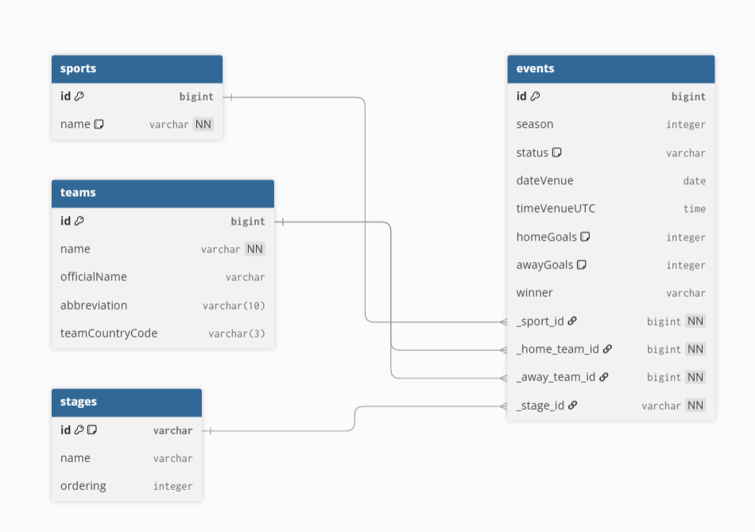

# Sportradar Coding Academy 2026 Backend Task

> A sports event calendar application built with Spring Boot and PostgreSQL.
> View, filter, and add sports events through a clean and responsive interface.

---

## Table of Contents

- [Overview](#-overview)
- [Tech Stack](#-tech-stack)
- [Project Structure](#-project-structure)
- [Database Design](#-database-design)
- [API Endpoints](#-api-endpoints)
- [Quick Start](#-quick-start)
- [Linux](#linux-via-docker)
- [Windows](#windows-via-docker)
- [Features](#-features)
- [Decisions & Assumptions](#-decisions--assumptions)
- [ERD Diagram](#-erd-diagram)

---

## Overview

This project was built as part of the **Sportradar Coding Academy 2026** Backend Coding Exercise.

The goal was to create a sports event calendar that allows events to be added and categorized based on sports. The application covers all three tasks from the exercise:

- **Task 1** — Database modeling with ERD and 3NF normalization
- **Task 2** — PostgreSQL implementation with proper primary and foreign keys
- **Task 3** — REST API backend + dynamic frontend served by Spring Boot

---

## Tech Stack

| Layer | Technology |
|-------|-----------|
| Backend | Java 21, Spring Boot 3 |
| Database | PostgreSQL 15 |
| ORM | Spring Data JPA / Hibernate |
| Frontend | Vanilla HTML, CSS, JavaScript |
| Build Tool | Maven |
| Containerization | Docker, Docker Compose |
| Testing | JUnit 5, Mockito |

---

## Project Structure

```
sportradar/
├── backend/                          # Spring Boot application
│   ├── src/main/java/org/example/sportradar/
│   │   ├── controller/               # REST API endpoints
│   │   ├── model/                    # Entity classes
│   │   ├── repository/               # JPA repositories
│   │   ├── service/                  # Business logic
│   │   └── exception/                # Global error handling
│   ├── src/main/resources/
│   │   ├── static/index.html         # Frontend (single page)
│   │   ├── application.properties    # App configuration
│   │   └── data.sql                  # Sample data
│   └── Dockerfile
├── database/
│   ├── data.json                     # Raw data source (provided by Sportradar)
│   └── erd_diagram.png               # Entity Relationship Diagram
├── docker-compose.yml
├── README.md
└── AI_Reflection.txt
```

---

## Database Design

The database follows **Third Normal Form (3NF)** to eliminate data redundancy.

| Table | Description |
|-------|-------------|
| `sports` | Sport types (Football, Ice Hockey) |
| `teams` | Team info (name, country, abbreviation) |
| `stages` | Competition stages (Group Stage, Round of 16, Final) |
| `events` | Main table connects all others via foreign keys |

All foreign keys are prefixed with underscore as required: `_sport_id`, `_home_team_id`, `_away_team_id`, `_stage_id`

See `database/erd_diagram.png` for the full diagram.

---

## API Endpoints

| Method | Endpoint | Description |
|--------|----------|-------------|
| `GET` | `/api/events` | Get all events |
| `GET` | `/api/events?sportId=1` | Filter events by sport |
| `GET` | `/api/events?date=2026-03-19` | Filter events by date |
| `GET` | `/api/events/{id}` | Get single event with full details |
| `POST` | `/api/events` | Add a new event |
| `GET` | `/api/teams` | Get all teams |

---

## Quick Start

### Linux (via Docker)

**Requirements:**
- Docker
- Docker Compose

**Installation:**

```bash
# Install Docker and Docker Compose
sudo apt-get update
sudo apt-get install docker.io docker-compose unzip -y

# Allow Docker to run without sudo (recommended)
sudo usermod -aG docker $USER
newgrp docker
```

**Run the application:**

1. Download the project as a ZIP from GitHub:
   [https://github.com/OzanCikriklioglu-cloud/sportradar-coding-academy-backend/archive/refs/heads/main.zip](https://github.com/OzanCikriklioglu-cloud/sportradar-coding-academy-backend/archive/refs/heads/main.zip)

2. Extract and navigate into the project folder:
```bash
unzip sportradar-coding-academy-backend-main.zip
cd sportradar-coding-academy-backend-main
```

3. Start the application:
```bash
docker-compose up --build
```

4. Open your browser and go to: **http://localhost:8080**

> Docker will automatically set up the PostgreSQL database and load all sample data. No additional configuration is needed.

---

### Windows (via Docker)

**Requirements:**
- Docker Desktop for Windows
- Download: [https://www.docker.com/products/docker-desktop/](https://www.docker.com/products/docker-desktop/)

**Installation:**

1. Download and install Docker Desktop, then start it. Make sure it is running (whale icon in the taskbar).

2. Download the project as a ZIP from GitHub:
   [https://github.com/OzanCikriklioglu-cloud/sportradar-coding-academy-backend/archive/refs/heads/main.zip](https://github.com/OzanCikriklioglu-cloud/sportradar-coding-academy-backend/archive/refs/heads/main.zip)

3. Extract the ZIP file and open the extracted folder.

4. Open a terminal inside the project folder:
   - Hold `Shift` and right-click inside the folder
   - Select **"Open PowerShell window here"** or **"Open Terminal here"**

5. Run the following command:
```powershell
docker-compose up --build
```

6. Open your browser and go to: **http://localhost:8080**

> Docker will automatically set up the PostgreSQL database and load all sample data. No additional configuration is needed.

---

## Features

- Interactive monthly calendar match days highlighted with an orange dot
- Filter events by status (played / scheduled) or by date
- Event detail page full match info with score, teams, stage
- Add new events via form directly in the calendar
- Teams page with search and sorting (A→Z, by country, by abbreviation)
- Browser back/forward button support
- Global error handling clean JSON error responses

---

## Decisions & Assumptions

**Why Spring Boot?**
Industry standard for Java REST APIs. Spring Data JPA significantly reduces boilerplate for database operations.

**Why PostgreSQL?**
Production-grade relational database used by companies like Sportradar. Chosen over SQLite for a more realistic setup.

**Efficient queries:**
All repository queries use `JOIN FETCH` to load related entities (teams, sport, stage) in a single SQL query. This avoids the N+1 problem no extra queries are executed inside loops.

**Foreign key naming:**
All foreign keys are prefixed with `_` as specified in the exercise (e.g. `_sport_id`, `_home_team_id`).

**Frontend approach:**
Single HTML file served by Spring Boot's static folder. Keeps the setup simple while fully meeting the frontend requirements.

**Sample data:**
Used the JSON file provided by Sportradar as reference and extended it with events from January to June 2026 to make the calendar more interesting to explore.

---

## ERD Diagram



*Built with ❤️ for Sportradar Coding Academy 2026*
